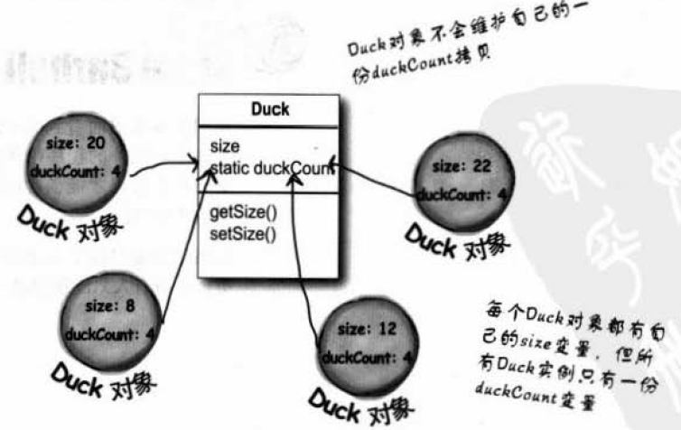

# 数字与静态
		静态方法
			通过Math引出静态方法
			静态方法和非静态方法差异
			不被实例化
		静态变量


## 静态方法

虽然java是完全面向对象编程的，但是对于一种不需要使用实例变量的方法，是否也需要创建对象来调用呢？

答案是不需要，java推荐使用静态方法来实现，原因是编程更高效，运行更快，节省内存。

* 通过Math引出静态方法
* 静态方法和非静态方法差异
* 不被实例化

### 通过Math引出静态方法

Math提供很多数值运算，比如round()， 如果使用呢？
```
Math math = new Math(); 	//报错，原因是构造函数是私有的 private
math.round(42.2);
```

正确用法是
```java
	double a1 = Math.round(42.2); // 四舍五入 等于42。0
	double a2 = Math.ceil(42.2); // 小数点进1 等于43.0
	double a3 = Math.floor(42.2); // 摄取小数点 等于42.0
```

这些方法无需实例变量，只靠参数，局部变量及运算逻辑来实现，也不需要特定对象来实现这个方法。

查看Math源码
```java
public final class Math {
    /**
     * Don't let anyone instantiate this class.
     */
    private Math() {}
		public static final double PI = 3.14159265358979323846;
		public static double random() {
        return RandomNumberGeneratorHolder.randomNumberGenerator.nextDouble();
    }
		public static int round(float a) {...}
		public static int round(double a) {...}
		public static double ceil(double a) {
        return StrictMath.ceil(a); // default impl. delegates to StrictMath
    }
    public static double floor(double a) {
        return StrictMath.floor(a); // default impl. delegates to StrictMath
    }

		// Math提供全是静态方法，这里只列出少部分常用的方法
}
```
**static**关键字标记出不需要类实例的方法

一种不依靠实例变量也就不需要对象的行为，我们就可以定义为静态方法

### 静态方法和非静态方法差异

```java
public class MyMin{
	private int a;
	private int b;
	public MyMin(int a, int b){
		this.a= a;
		this.b= b;
	}

	public int min1(){
		return a < b? a: b;
	}

	public static int min2(int one, int two){
		return one < tow? one: two;
	}
}
```

静态方法min2使用参数one和two来判断最小的值，并返回最小值，没有使用到对象中实例变量a或b；

非静态方法min1使用实例变量a和b来判断最小的值，并返回最小值。实例变量直接影响方法结果

调用时
1. 静态方法，通过类来调用`MyMin.min2(1,2)`
2. 非静态方法，通过对象来调用 `MyMin myMin =  new MyMin(1,2); myMin.min1()`


### 不被实例化

Math类，全部都是静态方法和静态变量，因此Math类不被实例化，可以将构造函数设置私有化private

对于抽象类，使用abstract来标识不能被实例化

拥有静态方法的类，也可以拥有非静态方法的类，因此一般定义为可以实例化，除非类中所有方法全部静态的。

在同一个类中，静态方法是不能调用非静态方法，也不能调用非静态变量。

## 静态变量

静态变量：它的值对所有的实例来说都是相同，因此可以用来统计类的实例个数。

### 静态变量被所有实例对象共享

```java
public class Duck{
	private int size;

	private static int duckCount;
	public Duck(){
		duckCount++;
	}
  public void setSize(int size){this.size = size;};
  public int getSize(){return this.size;};
}
```

当每new一个Duck实例时，count累加1；如果count不是静态变量时，每个duck实例的count值都是0，没法统计实例个数。

这就是静态变量功用：被所有实例对象共享。



### 静态变量的初始化

静态变量是在类被加载时初始化，类什么时候被加载呢？

1. 实例化类时，类会被加载
2. 调用静态方法或静态变量时，类会被加载

如上面实例 Duck类
```java
public class Duck{
    public static int duckCount=5;
    public Duck(){
        duckCount++;
    }
    public static void print(){
        System.out.println("duckCount :"+duckCount);
    }
}
```

因此静态变量会在下面两种情况进行初始化：
1. 静态变量会在该类的任何对象创建之前完成初始化 `new Duck()`
2. 静态变量会在该类的任何静态方法或静态变量调用之前就初始化 Duck `Duck.duckCount`

```java
  public static void main(String[] args) {
      System.out.println("duckCount :"+Duck.duckCount);
      Duck duck = new Duck();
      Duck.print();  //调用这个Duck.duckCount已经初始化，这就不用初始化了
	}

结果如下
	duckCount :5
	duckCount :6
```

如果没有给静态变量赋值，则和类的实例变量，jvm给默认值 int 0; float 0.0; boolean false; String null;

### 结合final静态变量

被标记过final变量，在初始化后，就不能在赋值。

使用static 和 final一起使用，就可以表示一个常量`public static final int MAX_SIZE=10`

常量命名规范，统一使用大写


final应用
0. final变量一定要进行初始化，也就是一定要赋初始值
1. 非静态final变量，在创建对象时，进行初始化，以后就不能改变
2. final方法，其子类中不能覆盖的方法
3. final类，不能被继承的类，比如 Math


## 静态类
