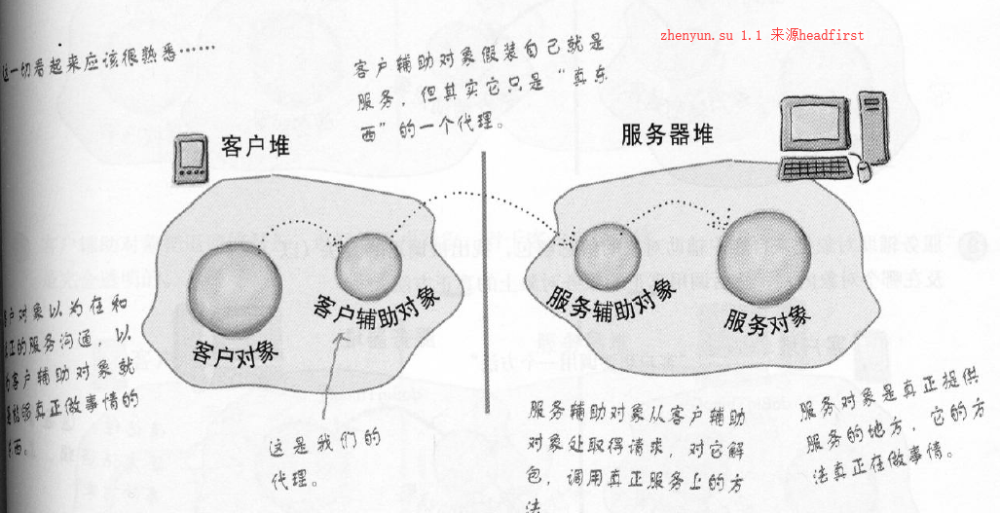
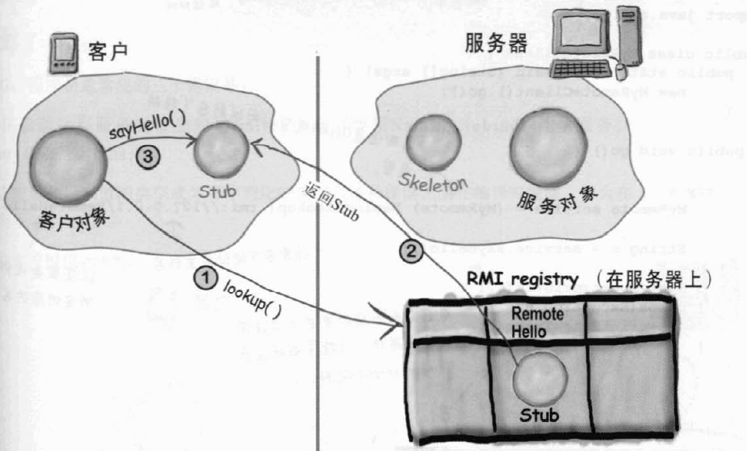

# 4远程方法调用
    RMI
    代码实现
    编写远程服务
      1. 定义远程服务接口
      2. 实现远程服务接口类
      3. 编写服务端启动远程服务
      4. 使用rmic生成辅助对象(stub)
      5. 将远程对象和辅助对象打包为jar
      6. 启动远程服务
    客户端调用远程服务
      客户端项目加载sample.jar
      客户端代码
    内置启动远程服务
    工作方式
    常见错误

## RMI概念

远程方法调用，就是从一个JVM能够调用其他JVM(可以本机其他JVM，或远程服务器JVM)中对象方法。

```
Java RMI(Remote Method Invocation)，java远程方法调用。
一种用于实现远程过程调用(RPC)(Remote procedure call)的Java API，
支持基本类型的变量或可序列化后的Java对象的数据交互
```

如何实现呢？ 借助辅助对象来帮我们实现远程数据交互。

客户通过访问客户辅助对象，客户辅助对象会自动转发到服务辅助对象上（通过socket传输），

服务辅助对象接收请求（通过socket链接），获取到调用信息，将调用信息解包后，然后调用真正服务对象上的方法

服务对象处理结束后返回结果，服务辅助对象将结果打包，然后运送回到客户辅助对象（通过socket传输），

客户辅助对象进行解包，最后将返回给客户对象



java如何实现呢? java的RMI提供客户辅助对象和服务辅助对象，以及其他工具。

RMI好处你不用写任何网络或I/O代码，客户程序调用远程方法就和运行客户自己的本地JVM上对象进行正常方法调用一样

## 代码实现

### 编写远程服务

1. 定义远程服务接口
2. 实现远程服务接口类
3. 编写服务端启动远程服务
4. 使用rmic生成辅助对象(stub)
5. 将远程对象和辅助对象打包为jar

#### 定义远程服务接口
```java
import java.rmi.Remote;
import java.rmi.RemoteException;

public interface MyRemote extends Remote {
    public String sayHello(String name) throws RemoteException;
}
```

1. 远程调用，需要使用网络服务，因此必须抛出远程调用的异常，供客户端处理。
2. 远程方法的变量数据类型和返回值数据类型，必须为基本数据类型或可序列化对象(Serializable)

#### 实现远程服务接口类

```java
import java.rmi.Naming;
import java.rmi.RemoteException;
import java.rmi.server.UnicastRemoteObject;
/**
 * @author : zhenyun.su
 * @comment :
 * @since : 2019/8/29
 */
public class MyRemoteImp extends UnicastRemoteObject implements MyRemote {
    @Override
    public String sayHello(String name) throws RemoteException {
        System.out.println("RMI Hello "+name);
        return "RMI Hello "+name;
    }

    public MyRemoteImp() throws RemoteException {
    }
}
```

#### 编写服务端启动远程服务

```java
public class MyRemoteServer {
    public static void main(String[] args) {
        try{
            MyRemote myRemote = new MyRemoteImp();
            Naming.rebind("RemoteHello",myRemote);
        }catch (Exception e){
            e.printStackTrace();
        }
    }
}
```

**UnicastRemoteObject**为你的子类提供了远程功能，另外它的构造器会抛出RemoteException，

因此必须在子类构造方法中抛出RemoteException

**Naming.rebind**将你的远程对象注册为远程服务,会注册到 `RMI registry`中

我们就通过rmi registry来查找到**RemoteHello**服务，进而访问myRemote对象

在客户端访问前，需要启动远程服务

#### 使用rmic生成辅助对象(stub)

编译出 MyRemote.class 和 MyRemoteImp.class

在classes目录下，执行下面命令
```
E:\rmi\sample\out\production\sample>rmic MyRemoteImp
```

自动生成MyRemoteImp_Stub.class，老版本rmi还会生成MyRemoteImp_Skeletion.class

#### 将远程对象和辅助对象打包为jar

使用idea工具打包，生成sample.jar 包含下面三个类

配置打包Jar: `project Structure -> Artifacts -> 新增 -> 选择Jar -> 选择`

编译jar: `Build -> Build Artifacts`

MyRemote.class ,MyRemoteImp.class及MyRemoteImp_Stub.class

sample.jar提供客户端调用

#### 启动远程服务

启动rmiregistry服务，提供rmi注册服务

在classes目录下，执行下面命令
```
E:\rmi\sample\out\production\sample>rmiregistry
```

执行远程服务对象，并注册到registry中
```
java MyRemoteServer
```

### 客户端调用远程服务

#### 客户端项目加载sample.jar

#### 客户端代码
```java
import java.rmi.Naming;
/**
 * @author : zhenyun.su
 * @comment :
 * @since : 2019/8/29
 */
public class MyRemoteClient {
    public static void main(String[] args) {
        try{
            MyRemote myRemote = (MyRemote) Naming.lookup("rmi://127.0.0.1/RemoteHello");
            String s=myRemote.sayHello("zhenyun.su");
            System.out.println(s);
        }catch (Exception e){
            e.printStackTrace();
        }
    }
}
```

通过Naming.lookup()获取远程服务，rmiregistry默认端口1099，可以不写

在服务端启用运程服务后，我们就可用验证

经测试，客户端和服务端都输出：RMI Hello zhenyun.su

### 内置启动远程服务

1099
```java
public class MyRemoteServer {
    public static void main(String[] args) {
        try{
            LocateRegistry.createRegistry(1099);
            MyRemote myRemote = new MyRemoteImp();
            Naming.rebind("RemoteHello",myRemote);
        }catch (Exception e){
            e.printStackTrace();
        }
    }
}
```

1099 是默认端口，也可以使用端口

```java
public class MyRemoteClient {
    public static void main(String[] args) {
        try{
            MyRemote myRemote = (MyRemote) Naming.lookup("rmi://127.0.0.1:1099/RemoteHello");
            String s=myRemote.sayHello("zhenyun.su");
            System.out.println(s);
        }catch (Exception e){
            e.printStackTrace();
        }
    }
}
```

重新测试通过

## 工作方式



1. 客户到RMI Registry中寻找  `Naming.lookup("rmi://127.0.0.1/RemoteHello")`
2. RMI Registry返回Stub对象，然后rmi自动对stub反序列化，实例化stub对象 (客户端必须由stub类 - 由rmic生成)
3. 客户端调用stub的方法，就像stub就是调用真正的服务对象


## 常见错误

1. 忘记在启动运程服务之前，启动rmiregistry
2. 忘记让变量和返回值的数据类型为基本类型或可序列化的对象
3. 忘记给客户端提供stub类
