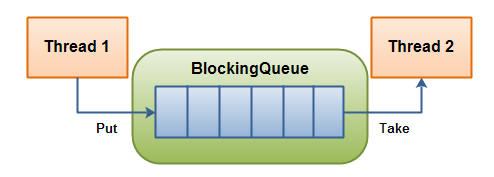

# Java Blocking Queues  ----- 阻塞队列

		什么是阻塞队列
		阻塞队列实现逻辑
		常用实现类
			DelayQueue - java编程思想 759页
      PriorityBlockingQueue

## 什么是阻塞队列

阻塞队列是一个什么样队列呢？

1. 尝试从空队列中出队的线程被阻塞，直到某个其他线程将项目插入队列。
2. 尝试往满的队列中的插入项的线程将被阻塞，直到某个其他线程将一个或多个项目移除出队列或完全清除队列。

下面的图表，显示了通过阻塞队列协作的两个线程



线程1往阻塞队列中新增数据

线程2从阻塞队列中获取数据

## 阻塞队列实现逻辑

```
public class BlockingQueue {

  private List queue = new LinkedList();
  private int  limit = 10;

  public BlockingQueue(int limit){
    this.limit = limit;
  }


  public synchronized void enqueue(Object item)
  throws InterruptedException  {
    while(this.queue.size() == this.limit) {
      wait();
    }
    if(this.queue.size() == 0) {
      notifyAll();
    }
    this.queue.add(item);
  }


  public synchronized Object dequeue()
  throws InterruptedException{
    while(this.queue.size() == 0){
      wait();
    }
    if(this.queue.size() == this.limit){
      notifyAll();
    }

    return this.queue.remove(0);
  }

}
```

## 常用实现类

### DelayQueue - java编程思想 759页

通过延时队列来实现同步功能

```java
public class DelayQueue<E extends Delayed> extends AbstractQueue<E>
    implements BlockingQueue<E> {
}
```

<E extends Delayed>泛型参数 指明 延时队列存放是实现Delayed接口的类的实例化对象

定为延时任务
```java
package concurrent.delayqueue;

import java.sql.Time;
import java.util.ArrayList;
import java.util.List;
import java.util.Random;
import java.util.concurrent.Delayed;
import java.util.concurrent.ExecutorService;
import java.util.concurrent.TimeUnit;

/**
 * @author : zhenyun.su
 * @comment :
 * @since : 2019-10-30
 */

public class DelayedTask implements Delayed {
    private static int counter = 0;
    private final int id = counter++;
    protected static List<DelayedTask> list = new ArrayList<DelayedTask>(); // 通过list按顺序存储DelayedTask对象
    private final int delta;  //
    private final long tigger;

    public DelayedTask(int delta) {
        this.delta = delta;
        this.tigger = System.nanoTime() + TimeUnit.NANOSECONDS.convert(delta, TimeUnit.MILLISECONDS);
        this.list.add(this);
    }
    public void run() {
        System.out.println(this);
    }

    @Override
    public int compareTo(Delayed o) {   //实现比较器逻辑
        DelayedTask that = (DelayedTask) o;
        return tigger < that.tigger ? -1 : (tigger > that.tigger ? 1 : 0);
    }
    @Override
    public long getDelay(TimeUnit unit) {  //用于告知延时有多长时间，返回纳秒
        return unit.convert((tigger - System.nanoTime()), TimeUnit.NANOSECONDS);
    }

    @Override
    public String toString() {
        return "task "+id+" delta "+delta;
    }
    public static class EndSentinel extends DelayedTask{   //定义延时任务的哨兵
        private ExecutorService executorService;
        public EndSentinel(int delta, ExecutorService executorService) {
            super(delta);
            this.executorService = executorService;
        }
        @Override
        public void run() {
            super.run();
            for (DelayedTask task: list){
                System.out.println("list info: "+task);
            }
            System.out.println("EndSentinel calling shutdownNow()");
            executorService.shutdownNow();
        }
    }
}
```


定义用于消费队列中的任务
```java
public class DelayedTaskConsumerJob implements  Runnable{
    private DelayQueue<DelayedTask> delayQueues;

    public DelayedTaskConsumerJob(DelayQueue<DelayedTask> delayQueues) {
        this.delayQueues = delayQueues;
    }

    @Override
    public void run() {
        try{
            while(!Thread.interrupted()){
                delayQueues.take().run();
            }
        }catch(Exception e){
            System.out.println("DelayedTaskConsumerJob interrupted");
        }
        System.out.println("DelayedTaskConsumerJob finish");
    }
}
```

执行测试
```java
public class Test {
    public static void main(String[] args) {
        final int maxDelta = 5000;
        Random random = new Random(47);
        ExecutorService executorService = Executors.newCachedThreadPool();
        DelayQueue<DelayedTask> queues = new DelayQueue<>();      //定义延时队列
        for (int i = 0; i < 20; i++) {                            //给延时队列，新增延时任务
            queues.put(new DelayedTask(random.nextInt(maxDelta)));
        }
        queues.add(new DelayedTask.EndSentinel(maxDelta, executorService)); //新增定义延时任务的哨兵
        executorService.execute(new DelayedTaskConsumerJob(queues));  //使用线程执行消费队列的任务
    }
}
```

输出如下
```
task 11 delta 128
task 7 delta 200
task 5 delta 429
task 18 delta 520
task 1 delta 555
task 4 delta 961
task 16 delta 998
task 9 delta 1207
task 2 delta 1693
task 14 delta 1809
task 3 delta 1861
task 15 delta 2278
task 10 delta 3288
task 12 delta 3551
task 0 delta 4258
task 19 delta 4258
task 8 delta 4522
task 13 delta 4589
task 17 delta 4861
task 6 delta 4868
task 20 delta 5000
list info: task 0 delta 4258
list info: task 1 delta 555
list info: task 2 delta 1693
list info: task 3 delta 1861
list info: task 4 delta 961
list info: task 5 delta 429
list info: task 6 delta 4868
list info: task 7 delta 200
list info: task 8 delta 4522
list info: task 9 delta 1207
list info: task 10 delta 3288
list info: task 11 delta 128
list info: task 12 delta 3551
list info: task 13 delta 4589
list info: task 14 delta 1809
list info: task 15 delta 2278
list info: task 16 delta 998
list info: task 17 delta 4861
list info: task 18 delta 520
list info: task 19 delta 4258
list info: task 20 delta 5000
EndSentinel calling shutdownNow()
DelayedTaskConsumerJob finish
```
DelayQueue - java编程思想 759页
### PriorityBlockingQueue

优先级阻塞队列的存储的对象需要实现Comparable接口比较方法，使用队列的对象可以按比较方法进行排序

下面通过生产任务将任务存放到队列中，再通过消费任务实现按优先级取出对象。

实现Comparable接口的任务类
```java
package concurrent.priorityqueue;

public class PrioritizedTask implements Runnable, Comparable<PrioritizedTask> {
    private static int counter = 0;
    private final int id = counter++;
    protected static List<PrioritizedTask> list = new ArrayList<PrioritizedTask>();
    private final int priority;

    public PrioritizedTask(int priority) {
        this.priority = priority;
        this.list.add(this);
    }

    public void run() {
        System.out.println(this);
    }

    @Override
    public int compareTo(PrioritizedTask o) {
        PrioritizedTask that = (PrioritizedTask) o;
        return priority < that.priority ? 1 : (priority > that.priority ? -1 : 0);
    }

    @Override
    public String toString() {
        return "task "+id+" delta "+priority;
    }
    public static class EndSentinel extends PrioritizedTask {
        private ExecutorService executorService;
        public EndSentinel(int priority, ExecutorService executorService) {
            super(priority);
            this.executorService = executorService;
        }
        @Override
        public void run() {
            super.run();
            for (PrioritizedTask task: list){
                System.out.println("list info: "+task);
            }
            System.out.println("EndSentinel calling shutdownNow()");
            executorService.shutdownNow();
        }
    }
}
```

批量生成任务的生产者
```java
public class PrioritizedProducer implements Runnable {
    private Random random = new Random(47);
    private Queue<Runnable> queues;
    private ExecutorService executorService;

    public PrioritizedProducer(Queue<Runnable> queues, ExecutorService executorService) {
        this.queues = queues;
        this.executorService = executorService;
    }

    @Override
    public void run() {
				for (int i = 0; i < 3; i++) {
            queues.add(new PrioritizedTask(random.nextInt(3)));
        }
        try{
            for (int i = 0; i < 2; i++) {
                TimeUnit.MILLISECONDS.sleep(250);
                queues.add(new PrioritizedTask(3));
            }
            for (int i = 0; i < 2; i++) {
                queues.add(new PrioritizedTask(i));
            }

            queues.add(new PrioritizedTask.EndSentinel(-1, executorService));
        }catch(InterruptedException e){
            System.out.println("PrioritizedProducer interrupted");
        }
        System.out.println("PrioritizedProducer finish");
    }
}
```

按队列消费任务
```java
public class PrioritizedConsumer implements Runnable {
    private PriorityBlockingQueue<Runnable> queues;
    public PrioritizedConsumer(PriorityBlockingQueue<Runnable> queues) {
        this.queues = queues;
    }

    @Override
    public void run() {
        try{
            while(!Thread.interrupted()){
                queues.take().run();
            }
        }catch(InterruptedException e){
            System.out.println("PrioritizedConsumer interrupted");
        }
        System.out.println("PrioritizedConsumer finish");
    }
}
```

```java
public class Test {
    public static void main(String[] args) {
        ExecutorService executorService = Executors.newCachedThreadPool();
        PriorityBlockingQueue<Runnable> tasks = new PriorityBlockingQueue<>();
        executorService.execute(new PrioritizedProducer(tasks,executorService));
        executorService.execute(new PrioritizedConsumer(tasks));
    }
}
```

输出
```
task 0 delta 2
task 1 delta 2
task 2 delta 1
task 3 delta 3
task 4 delta 3
task 5 delta 0
task 6 delta 1
task 7 delta -1
list info: task 0 delta 2
list info: task 1 delta 2
list info: task 2 delta 1
list info: task 3 delta 3
list info: task 4 delta 3
list info: task 5 delta 0
list info: task 6 delta 1
list info: task 7 delta -1
EndSentinel calling shutdownNow()
PrioritizedProducer finish
PrioritizedConsumer finish
```
