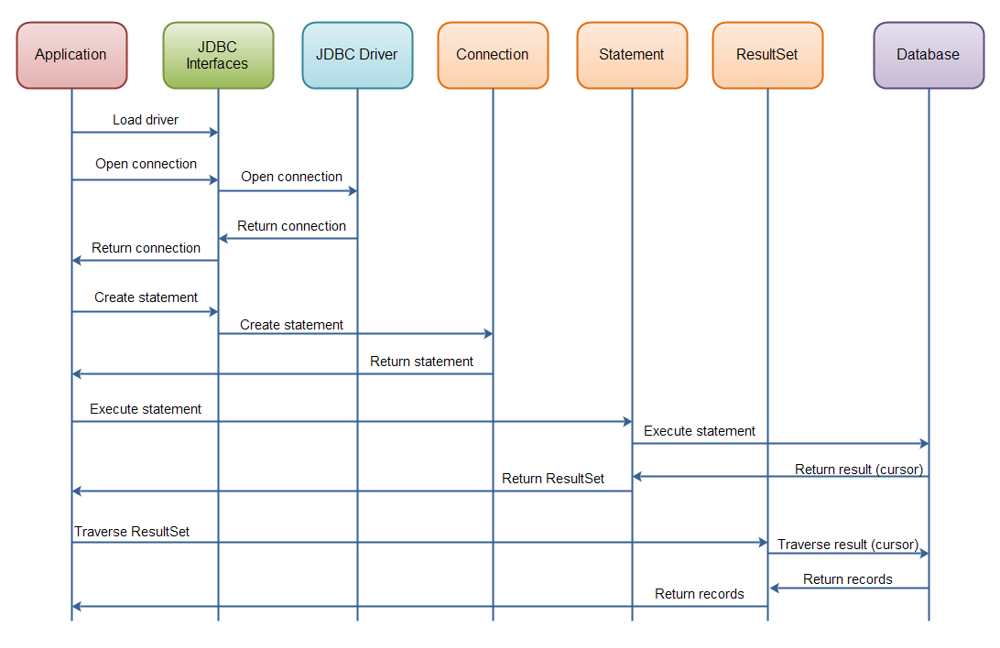

# JDBC Overview

The Java JDBC API enables Java applications to connect to relational databases via a standard API, so your Java applications become independent (almost) of the database the application uses.

```
Core JDBC Components
    JDBC Drivers
    Connections
    Statements
    ResultSets
Common JDBC Use Cases
    Query the database
    Query the database meta data
    Update the database
    Perform transactions
A JDBC Component Interaction Diagram
```

## Core JDBC Components

### JDBC Drivers

A JDBC driver is a collection of Java classes that enables you to connect to a certain database. For instance, MySQL will have its own JDBC driver. A JDBC driver implements a lot of the JDBC interfaces. When your code uses a given JDBC driver, it actually just uses the standard JDBC interfaces. The concrete JDBC driver used is hidden behind the JDBC interfaces. Thus you can plugin a new JDBC driver without your code noticing it.

Of course, the JDBC drivers may vary a little in the features they support.

### Connections

Once a JDBC driver is loaded and initialized, you need to connect to the database. You do so by obtaining a`Connection`to the database via the JDBC API and the loaded driver. All communication with the database happens via a connection. An application can have more than one connection open to a database at a time. This is actually very common.

### Statements

A`Statement`is what you use to execute queries and updates against the database. There are a few different types of statements you can use. Each statement corresponds to a single query or update.

### ResultSets

When you perform a query against the database you get back a`ResultSet`. You can then traverse this`ResultSet`to read the result of the query.

## Common JDBC Use Cases

### Query the database

One of the most common use cases is to read data from a database. Reading data from a database is called querying the database.

### Query the database meta data

Another common use case is to query the database meta data. The database meta data contains information about the database itself. For instance, information about the tables defined, the columns in each table, the data types etc.

### Update the database

Another very common JDBC use case is to update the database. Updating the database means writing data to it. In other words, adding new records or modifying (updating) existing records.

### Perform transactions

Transactions is anoter common use case. A transaction groups multiple updates and possibly queries into a single action. Either all of the actions are executed, or none of them are.

## A JDBC Component Interaction Diagram

Here is an example of how the core components interact in during the execution of a database query (click image to view larger version):


