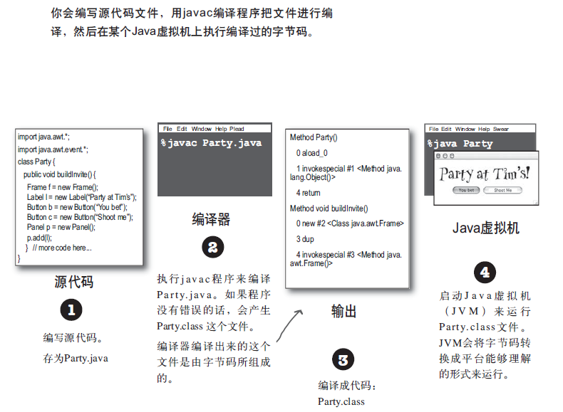

# 1基本概念

## java工作方式

## 发展史

截止到2019-09-40主流版本为java8(java 1.8)，最新版本java11

java1.1, 1.2, 1.5, 1.8是开发版本号了，而java2， java5， java8是销售部门使用版本号了。

而java3， java4没有出现过。

## java程序结构

1. 源文件， 带着类定义，以扩展名为.java的文件，类用来表示一个程序组，内容必须包含在花括号里面。
2. 类， 类中带着一个或多个方法，方法必须定义在类内部声明。
3. 方法，方法内容包含在花括号里面，定义可执行的语句

## java内部运行机制

当java虚拟机启动时，或查找命令列表指定的类，然后再查找类中main()方法。

接着java虚拟机就会执行main方法中所有代码语句。

每个java程序必须有至少一个类及只有一个main方法

## java实践过程

## 疑问

1. 为什么所有语句必须包含在类中，因为java是面向对象编程，
2. 不是每个类都需要加上main()方法
3. java是强类型语言，不能使用integer直接替换boolean来使用

## 语法要点：
1. 语句以分号;结束，花括号{},小括号()不用使用分号;
2. 程序块用{}来圈定

## 编译器与虚拟机区别

### 编译器 - javac

1. 语法检查，防止低级debug再运行时出现，比如类型检查
2. 将源代码编译为字节码（java虚拟机可识别可运行的代码）

为什么不直接编译成二进制代码呢？，为了支持跨平台

### 虚拟机 - java

用于执行字节码文件。
