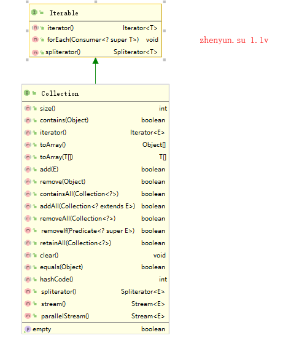
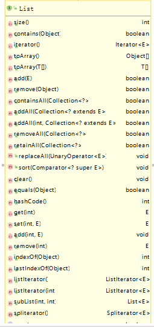
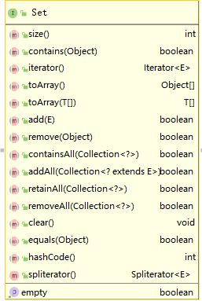
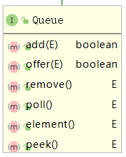
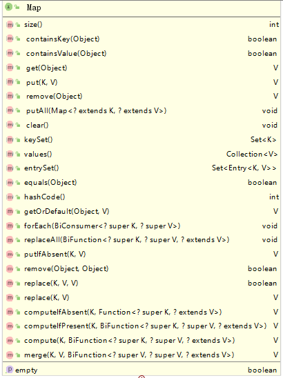
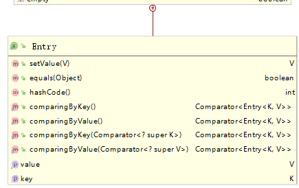

# 1概念

		为什么需要集合
			业务需求驱动
			为什么要使用JDK集合框架
		集合与泛型
		集合接口
		JDK集合框架
			列表 - List
			集合 - Set
			单向队列 - queue
			双向队列 - deque
			键值对 - map

## 为什么需要集合

本文大部分来源java编程思想 236页

### 业务需求驱动

程序在执行过程中，由于业务需求，可能需要在任何时刻，需要创建任何对象，

因此我们需要一个容器来存储，管理对象。并使用这些容器能进行遍历对象。这些存放对象的容器，统称集合

当然我们可以使用数组来存储，这个是编译器支持的类型，但是数组具有固定大小，而一般情况时，需要动态变化。

java提供集合对象，支持动态变化

java提供四个基本的集合类型：List, set, 	queue和map

### 为什么要使用JDK集合框架

1. 使用集合框架可以降低开发成本，无需重复造轮子
2. 使用JDK集合框架，满足业务场景，功能齐全，安全稳定，官网持续维护。

## 集合与泛型

```java
   ArrayList objects = new ArrayList();
	 objects.add(new Apple());
	 object.add(new Orange());
```

我们可以将不同类Apple和Orange都存放在ArrayList中

由于Apple和Orange默认都是从Object继承的，因此ArrayList可以同时存放Apple和Orange，不会报错误信息，

在使用时，需要强制转换，但是编译时将报警告信息，这是因为ArrayList没有使用泛型导致

我们可以通过注解 @SuppressWarnings("unchecked")来消除警告，最后的方法使用泛型来解决

```java
   ArrayList<Apple> objects = new ArrayList();
	 objects.add(new Apple()); //正常使用
	 object.add(new Orange()); //直接报错，防止不同类存放ArrayList中
```

还有一个好处，我们直接从List获取对象时，不用强制转换为Apple了

## 集合接口

### list，set，queue

```java
public interface Iterable<T>{}
public interface Collection<E> extends Iterable<E>{}
```
Iterable接口实现了返回迭代器，遍历方法

Collection接口实现集合对象基本操作，size()，contains(Object o)，isEmpty()， add(Object o) 等等方法

List， set ，queue接口都是从Collection继承下来的。





Iterable和Collection提供通用集合操作接口

* list针对列表操作，从开始按顺序插入列表，可以重复插入，读取时按索引号读取。
* set针对集合操作，不能重复插入
* queue针对队列操作，只能头或尾部进，头出或尾部出

### map

map是一组成对的“键值对”，允许你用键来操作值，采用映射表的关系，将键和值联系在一起，也称为“关联数组”




```java
public interface Map<K,V> {
		interface Entry<K,V> {

		}
}
```

更多实现类，请看下面一览表

## JDK集合框架

JDK集合框架，主要提供以下数据结构的支持

* 列表 - List
* 集合 - Set
* 队列 - queue/deque
* 键值对 - map

在后面的章节，我们通过接口和实现来讲解如何使用

### 列表 - List

|列表类|结构|描述|
|-|-|-|
|ArrayList|列表(数组)结构|遍历速度快，CRUD操作相对慢，通过下标访问元素最快|
|LinkedList|链表结构|CRUD操作相对快，只需要改变前后两个节点指针指向，输出顺序和输入顺序一致|

### 集合 - Set

|集合类|结构|描述|
|-|-|-|
|HashSet|集合结构|存储无序的，唯一的，可包含唯一一个Null对象，通过foreach和迭代器来遍历元素|

### 单向队列 - queue

|queue队列类|结构|描述|
|-|-|-|
|ConcurrentLinkedQueue|基于链表的队列|线程安全,保证入队和出队操作的原子性和一致性，但在遍历和size()操作时只能保证数据的弱一致性|
|LinkedBlockingQueue|基于加锁链表的队列|线程安全,入队时如果队列已满或在出队时如果队列已空,线程被阻塞|
|ArrayBlockingQueue|基于数组实现|有界的阻塞队列,其同步阻塞机制的实现与LinkedBlocklingQueue基本一致|
|SynchronousQueue|同步队列|生产者线程需要及时确认到自己生产的任务已经被消费者线程取走后才能执行后续逻辑的场景下|
|PriorityQueue|优先排序队列|非阻塞队列，也不是线程安全，元素的优先级进行排序，保证最小的元素最先出队|

### 双向队列 - deque

|deque队列类|结构|描述|
|-|-|-|
|ConcurrentLinkedDeque|基于双向链表的队列|特性和ConcurrentLinkedQueue一样|
|LinkedBlockingDeque|基于双向加锁链表的队列|特性和LinkedBlockingDeque一样|


### 键值对 - map

|map类|结构|描述|
|-|-|-|
|HashMap|键值对集合结构|将key 和value对象存储到set集合中，通过key来标识对象value，线程不安全，多线程数据不能保证一致性|
|ConcurrentHashMap|键值对集合结构|它是线程安全的，通过分16段Segment进行加锁，提高读写并发效率，多线程保持数据一致性|
|LinkedHashMap|基于链表的键值对集合结构|可快速进行插入，删除|
|TreeMap|基于红黑二叉树的Map结构|TreeMap能够实现Entry的排序和快速查找|


下章节，我们介绍如何操作集合类
