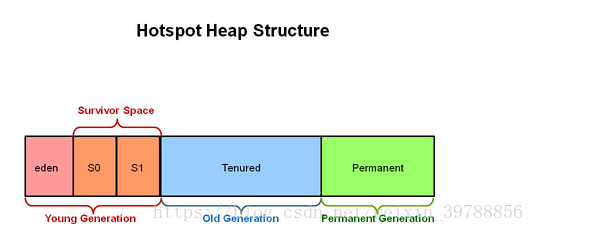

# 3内存管理

    java内存结构
      1程序计数器（Program Counter Register）
      2虚拟机栈（JVM Stack）
      3本地方法栈（Native Method Stack）
      4方法区（Method Area）
      5堆区（heap）
    下一步行动

## java内存结构

根据JVM规范，JVM把内存划分了如下几个区域
* 1程序计数器（Program Counter Register）
* 2虚拟机栈（JVM Stack）
* 3本地方法栈（Native Method Stack）
* 4方法区（Method Area）
* 5堆区（heap）

如图所示


### 1程序计数器（Program Counter Register）

程序计数器是一个比较小的内存区域，主要用于记录当前线程所执行的字节码的行号。

```
当程序在执行时，会不断记录字节码执行的行号，
当CPU从其他线程切换回本线程时，通过程序计数器获取字节码的行号，靠行号取的下一条字节码指令。
保证本线程能继续执行原来的工作
```

### 2虚拟机栈（JVM Stack）

虚拟机栈用于存储当前线程执行方法时所需要的内存，

```
当线程调用方法时都会创建一个栈帧，并从栈顶压入到虚拟机栈中，
栈帧中存储的有局部变量表、操作指令、动态链接、方法出口等等

当线程执行方法时，从栈顶获取栈帧，进行逻辑处理，处理结束后，返回结果给方法出口，并释放栈帧;

若执行过程中还调用其他方法,比如A方法，则创建A方法的栈帧，压入栈顶，
此时线程先处理A方法的逻辑，直到处理结束，通过方法出口将返回结果给当前方法。

动态链接用于保存native本地方法的引用，若在执行native方法时，也会创建栈帧压入本地方法栈中，其机制和虚拟机栈一样
```

局部变量表中存储着方法的相关局部变量及方法参数，包括各种基本数据类型，对象的引用，返回地址等。
```
在局部变量表中，对应64位的long和double类型会占用2个局部变量空间slot（对于32位机器，一个Slot就是32个bit。
需要注意的是，局部变量表占用的内存空间是在编译时就已经确定好的，
因此方法运行所需要分配的内存空间在栈帧中是完全确定的，在方法的生命周期内都不会改变。
```

虚拟机栈中定义了两种异常
```
如果线程调用的栈深度大于虚拟机允许的最大深度，则抛出StatckOverFlowError（栈溢出）

为防止栈溢出，多数Java虚拟机都允许动态扩展虚拟机栈的大小，直到可用物理内存不足，
此时会抛出OutOfMemoryError（内存溢出）
```

关于对象及对象方法调用，堆栈机制如何来完成，请看 **1JDK语言-> 第一阶段-> 对象**

### 3本地方法栈（Native Method Stack）

本地方法栈和虚拟机方法栈运行机制一致，用于native方法执行所需的内存
```
和虚拟机栈唯一的区别就是，虚拟机栈是执行Java方法的，而本地方法栈是用来执行native方法的，
在很多虚拟机中（如Sun的JDK默认的HotSpot虚拟机），会将本地方法栈与虚拟机栈放在一起使用。
```

### 4方法区（Method Area）

方法区用于保存类信息(如类名，修饰符)、静态变量、常量、成员及方法信息，

可以理解为加载从字节码.class文件加载进入的数据提供内存空间

方法区为jvm启动的进程内存，为所有线程提供运行时共享数据的内存区

运行时常量池（Runtime Constant Pool）,它是方法区中重要的一部分

用于存储编译期就生成的字面常量及由符号引用编译出来的直接引用

#### 字面常量

直接被常量值赋值的变量，在java程序设计语言中就叫普通变量，在jvm虚拟机内存字节码结构中叫字面常量。

```java
public static void main(String[] args) {
        String s1 = "zhenyun.su";
        String s2 = "zhenyun.su";
        String s3 = new String("zhenyun.su");

        System.out.println(s1==s2);         //true  说明s1和s2变量的存储相同的引用地址，指向相同对象
        System.out.println(s1.equals(s2));  //true  说明s1和s2变量的指向引用对象的值是一样
        System.out.println(s1==s3);         //false 说明s1和s3变量的存储不相同的引用地址，指向不同对象
        System.out.println(s1.equals(s3));  //true  说明s1和s3变量的指向引用对象的的值是一样
    }
```

在方法局部变量s1和s2的值为字面常量，它在编译时会在字节码文件的常量池计数器中存放一个`zhenyun.su`字面常量,

然后将引入地址赋值给字节码文件的字段表中的s1和s2，这里涉及到字节码文件结构，请看 **2字节码**

不管定义的是方法中局部变量，还是类常量，类静态变量，如果是字面常量都会放在运行时常量池中


#### 符号引用

符号引用是指用字符串来代表某个变量、某个接口名称，某个类，而直接引用就是字符引用存储在常量池中的引用地址

在编译时已经将符号引用映射为直接引用，因此在运行时使用类，或变量时都是用直接引用，这样设计目的提供运行效能。


当方法区使用的内存超过它允许的大小时，就会抛出OutOfMemory：PermGen Space异常。

在Hotspot虚拟机中，这块区域对应的是Permanent Generation(持久代)
```
一般的，方法区上执行的垃圾收集是很少的，因此方法区又被称为持久代的原因之一，
但这也不代表着在方法区上完全没有垃圾收集，其上的垃圾收集主要是针对常量池的内存回收和对已加载类的卸载。

在方法区上进行垃圾收集，条件苛刻而且相当困难。    
```

### 5堆区（heap）

堆区用来存储对象实例及数组值，可以认为java中所有通过new创建的对象都在此分配。
```
在JVM所管理的内存中，堆区是最大的一块，堆区也是垃圾回收机制所管理的主要内存区域，
```

堆区由所有线程共享，在虚拟机启动时，按启动参数创建。
```
对于堆区大小，可以通过参数-Xms和-Xmx来控制，
-Xms为JVM启动时申请的初始堆内存，默认为物理内存的1/64但小于1GB;
-Xmx为JVM可申请的最大堆内存，默认为物理内存的1/4但小于1GB,

默认当剩余堆空间小于40%时，JVM会增大堆到-Xmx大小，可通过-XX:MinHeapFreeRadio参数来控制这个比例；
当空余堆内存大于70%时，JVM会减小Heap大小到-Xms指定大小，可通过-XX:MaxHeapFreeRatio来指定这个比例。
对于系统而言，为了避免在运行期间频繁的调整Heap大小，通常将-Xms和-Xmx设置成一样。

为了让内存回收更加高效，从Sun JDK 1.2开始对堆采用了分代管理方式，如下图所示：
```


堆内存被分为年轻代和老年代，比例按3分之一，和3分之二来分配，

也可以通过参数指定年轻代大小，剩下就是老年代大小

#### 年轻代（Young Generation）
```
对象在被创建时，内存首先是在年轻代进行分配（注意，大对象可以直接在老年代分配）。
当年轻代需要回收时会触发Minor GC(也称作Young GC)。

年轻代的Eden区内存是连续的，所以其分配会非常快；同样Eden区的回收也非常快
因为大部分情况下Eden区对象存活时间非常短，而Eden区采用的复制算法，此算法在存活对象比例很少的情况下非常高效。
如果在执行垃圾回收之后，仍没有足够的内存分配，也不能再扩展，将会抛出OutOfMemoryError:Java Heap Space异常。

年轻代由Eden Space和两块相同大小的Survivor Space（又称From Space和To Space）构成，
Eden区和Servior区的内存比为8:1，
可通过-Xmn参数来调整新生代大小，如果没有指定，是否为为3三之一的堆大小 ？？？
也可通过-XX:SurvivorRadio来调整Eden Space和Survivor Space大小。
不同的GC方式会按不同的方式来按此值划分Eden Space和Survivor Space，
有些GC方式还会根据运行状况来动态调整Eden、From Space、To Space的大小。
```

#### 老年代（Old Generation）

```
老年代用于存放在年轻代中经多次垃圾回收仍然存活的对象，可以理解为比较老一点的对象，例如缓存对象；
新建的对象也有可能在老年代上直接分配内存，这主要有两种情况：

一种为大对象，表示超过多大时就不在年轻代分配，而是直接在老年代分配。
可以通过启动参数设置-XX:PretenureSizeThreshold=1024，

另一种为大的数组对象，且数组存放的为基本类型。

当老年代满了的时候就需要对老年代进行垃圾回收，老年代的垃圾回收称作major GC。
老年代所占用的内存大小为-Xmx对应的值减去-Xmn对应的值 或者为堆内存三分之二 ？？？
```

## 下一步行动

垃圾回收

## 参考资料

https://blog.csdn.net/weixin_39788856/article/details/80388002
