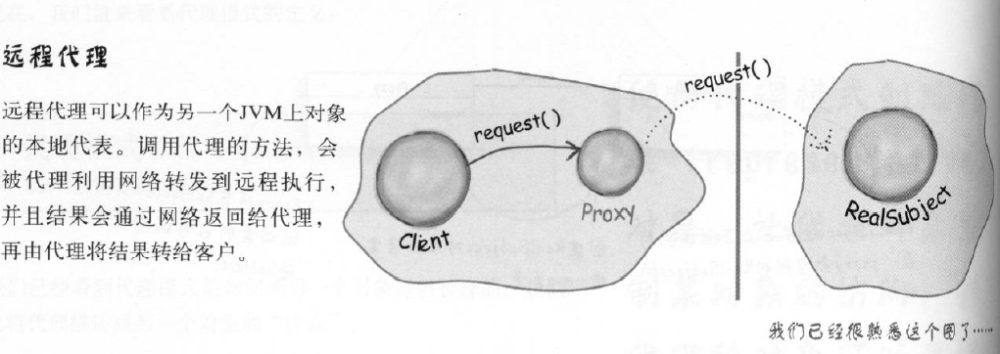
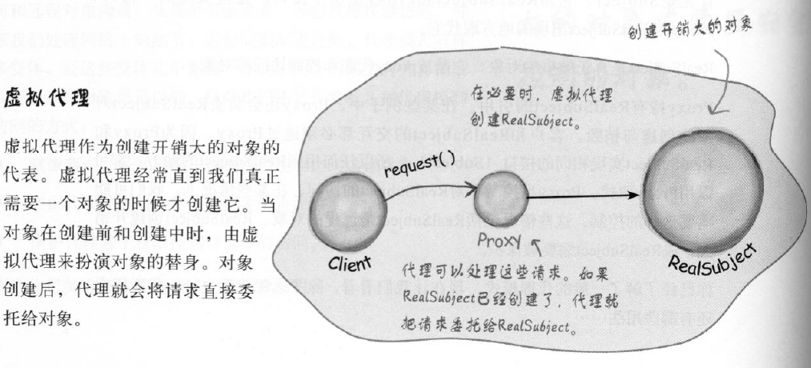

# 11代理模式

    业务场景
    面向对象解决方法
    代码实现
    模式定义
    深度和其他模式差异及主要应用在哪些场景

状态模式核心思想是解决控制和管理访问。

你能提供很优质的服务，但是你不希望每个人都叫你做事，因此你可以找个黑脸控制对你的访问。

## 业务场景

## 面向对象解决方法

## 代码实现

## 模式定义

代理模式(proxy Pattern)定义：为另外一个对象提供一个替身，以控制对这个对象的访问。

使用代理模式创建代表对象，让代表对象控制某些对象的访问，

被代理的对象可以是远程对象，创建开销大的对象或哦需要安全控制的对象

代理模式类图：

## 深度和其他模式差异及主要应用在哪些场景

### 代理模式更多应用

#### 远程代理

#### 虚拟代理

### 和装饰者模式区别

装饰者模式为对象增加行为，而代理模式是控制对象的访问。

我们是如何让客户使用代理而不是真正对象

常用技巧提供一个工厂，实例化并返回主题。因为在工厂内部发生的，客户并不知道也不在乎。

### 和适配器模式区别

适配器模式会改变对象适配的接口，而代理则实现相同的接口

### 如何使用Java Api来实现代码

java.lang.reflect

494 页面，明天继续搞
