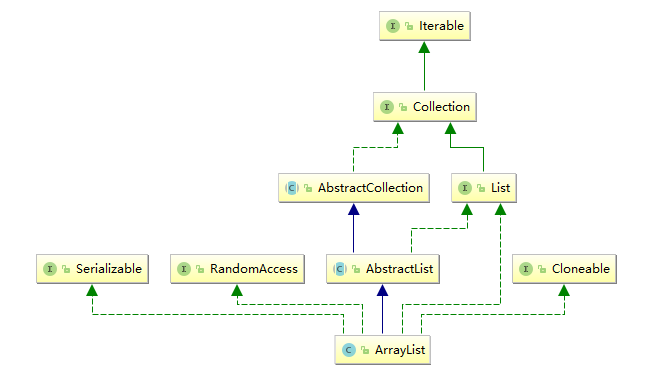
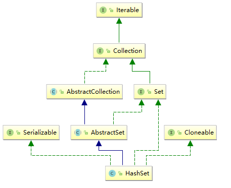

# collection implementions

		Java Collections - List
		Java Collections - Set
		Java Collections - SortedSet

collection implementions class

下面将介绍常用集合实现类

## Java Collections - List

List Implementations

> * java.util.ArrayList
> * java.util.LinkedList
> * java.util.Vector
> * java.util.Stack

ArrayList Class hierarchy


```
List listA = new ArrayList();
List listB = new LinkedList();
List listC = new Vector();
List listD = new Stack();
```

* Adding and Accessing Elements

```
List listA = new ArrayList();
listA.add("element 1");
listA.add("element 2");

String element0 = listA.get(0);
String element1 = listA.get(1);
```

* Removing Elements
> 1. remove(Object element)
> 2. remove(int index)


* Clearing a List
> list.clear();
* List Size
> int size = list.size();
* Generic Lists

```
MyObject myObject = list.get(0);

for(MyObject anObject : list){
   //do someting to anObject...
}
```

* Iterating a List

```
Iterator iterator = listA.iterator();
while(iterator.hasNext(){
  String element = (String) iterator.next();
}


//access via new for-loop
for(Object object : listA) {
    String element = (String) object;
}
```

## Java Collections - Set

Set Implementations

> * java.util.EnumSet
> * java.util.HashSet
> * java.util.LinkedHashSet
> * java.util.TreeSet

HashSet Class hierarchy


```
Set setA = new EnumSet();
Set setB = new HashSet();
Set setC = new LinkedHashSet();
Set setD = new TreeSet();
```

Adding and Accessing , remote, clear and iterator Elements same list

```
Set setA = new HashSet();

setA.add("element 0");
setA.add("element 1");
setA.add("element 2");

//access via Iterator
Iterator iterator = setA.iterator();
while(iterator.hasNext(){
  String element = (String) iterator.next();
}


//access via new for-loop
for(Object object : setA) {
    String element = (String) object;
}

```

## Java Collections - SortedSet


put out set item for sorted aec

```

    public static void main(String[] args){
        SortedSet<Integer> sset = new TreeSet<>();
        sset.add(2);
        sset.add(1);
        sset.add(3);
        Iterator<Integer> iterator= sset.iterator();
        while(iterator.hasNext()){
            System.out.println(iterator.next());
        }
    }
```

## Java hashMap

hashMap Class hierarchy

