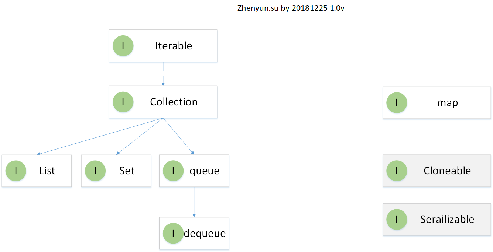

# collections interface

		interface - Overview
		Iterable interface
		collection interface
		map interface
		集合方法实例


## interface - Overview

 The Java Collections API's provide Java developers with a set of classes and interfaces that makes it easier to handle collections of objects

 it is useful to have an overview of the interfaces it contains

 there are two "groups" of interfaces: Collection's and Map's.

interface hierarchy 




map intrface hierarchy


JDK提供的集合接口不限于上面列出来的

集合根接口iterable

## Iterable interface

The Iterable interface (*java.lang.Iterable*) is one of the root interfaces of the Java collection classes. 
The Collection interface extends Iterable, so all subtypes of Collection also implement the Iterable interface

The Iterable interface has only one method:
```
public interface Iterable<T> {
  public Iterator<T> iterator();    
}
```

iterable 提供返回iterator迭代器，通过迭代器可以实现集合的遍历

```
public interface Iterator<E> {
    boolean hasNext();
    E next();
```

如下遍历
```
    while (xxx.hasNext){
        statement;
	xxx.next;
    }
```

## collection interface

The Collection interface (java.util.Collection) is one of the root interfaces of the Java collection classes. 

collection接口主要提供如下方法

|方法|描述|
|-|-|
|add|添加一个元素|
|addAll|添加所有元素|
|remove|移除一个元素|
|removeAll|移除所有元素|
|iterator|返回迭代器|
|size|集合大小|
|clear|清空集合|
|contains|集合是否包含某个元素|
|isEmpty|集合是否为空|


Collection 子接口如下

* List
* Set
* SortedSet
* NavigableSet
* Queue
* Deque

List 和set 的使用参考collection通用接口，下面介绍下queue和deque

Queue和Deque接口继承Collection接口，实现FIFO（先进先出）的集合

二者的区别在于，Queue只能在队尾入队，队头出队，而Deque接口则在队头和队尾都可以执行出/入队操作

### Queue 

* add(E)/offer(E)：入队，即向队尾追加元素，二者的区别在于如果队列是有界的，add方法在队列已满的情况下会抛出IllegalStateException，而offer方法只会返回false
* remove()/poll()：出队，即从队头移除1个元素，二者的区别在于如果队列是空的，remove方法会抛出NoSuchElementException，而poll只会返回null
* element()/peek()：查看队头元素，二者的区别在于如果队列是空的，element方法会抛出NoSuchElementException，而peek只会返回null

### Deque 

* addFirst(E) / addLast(E) / offerFirst(E) / offerLast(E)
* removeFirst() / removeLast() / pollFirst() / pollLast()
* getFirst() / getLast() / peekFirst() / peekLast()
* removeFirstOccurrence(Object) / removeLastOccurrence(Object)

### map interface

map不像collection本身是集合，map成员包含集合的实现

Map用于存储键值对，为其中的每个对象指定了一个key，并使用Entry保存每个key-value对到 **set集合**中

我们可以通过key快速定位到对象(value)。

Map接口的主要方法包括：

* size()			- 集合内的对象数量
* put(K,V)			- 向Map内添加单个对象
* putAll(Map)		- 向Map内添加批量对象
* get(K)			- 返回Key对应的对象
* remove(K)		- 删除Key对应的对象
* containsKey(K)	- 判断Map中是否存在指定key
* containsValue(V)	- 判断Map中是否存在指定value
* keySet()			- 返回包含Map中所有key的Set
* values()			- 返回包含Map中所有value的Collection
* entrySet()		- 返回包含Map中所有key-value对的EntrySet

map集合遍历方法，可以通过map.entryset 的set迭代器进行遍历，也可以使用 map.foreach 来遍历


## 集合方法实例

```
public class MyCollectionUtil {

    public static void printlnItem(Collection collection){
        Iterator iterator = collection.iterator();
        while (iterator.hasNext()){
            System.out.println(iterator.next());
        }
    }
}


public class MyMain {
    public static void main(String[] args){
        List<String> list = new ArrayList<>();
        list.add("zhenyun.su");

        Set<Integer> set = new HashSet<>();
        set.add(1);
        set.add(2);

        MyCollectionUtil.printlnItem(list);
        MyCollectionUtil.printlnItem(set);
    }
}

```

#### Adding and Removing Elements

```
public class MyCollectionUtil {

    public static void addItem(Collection collection, Object o){
        collection.add(o);
    }

    public static void clearItem(Collection collection){
        collection.clear();
    }

    public static void remoteItem(Collection collection, Object o){
        collection.remove(o);
    }
}

public class MyMain {
    public static void main(String[] args){
        List<String> list = new ArrayList<>();
        list.add("zhenyun.su");

        Set<Integer> set = new HashSet<>();
        set.add(1);
        set.add(2);

        Map<Integer, String> map = new HashMap<>();
        map.put(1, "asu1");
        map.put(2, "asu2");

        MyCollectionUtil.clearItem(list);
        MyCollectionUtil.addItem(list, "asushiye");
        MyCollectionUtil.printlnItem(list);

        MyCollectionUtil.remoteItem(set, 2);
        MyCollectionUtil.printlnItem(set);
        MyCollectionUtil.printlnItem(map.entrySet());

    }
}

```
addAll Collection from other collection

```
        Collection collection = new HashSet();
        collection.addAll(set);
        MyCollectionUtil.printlnItem(collection);
        collection.removeAll(set);
```


#### Checking if a Collection Contains a Certain Element and collection size

```
        System.out.println(collection.contains(1));
        collection.removeAll(set);
        System.out.println(collection.contains(1));
	int numberOfElements = collection.size();
```


refer to：JavaGenerics


