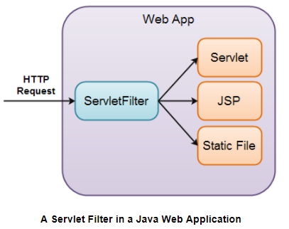

# Java Servelet class

chapter-30-03

```
        Cookies
        Servlet Filters
        GZip Servlet Filter
        Servlet Concurrency
```

## Cookies

- write cookie to response
- Reading Cookies Sent From the Browser
- Cookie Expiration
- Removing Cookies
- Additional Cookie Settings
- Cookie Use Cases

### write cookie to response

```
Cookie cookie = new Cookie("myCookie", "myCookieValue");

response.addCookie(cookie);
```

### Reading Cookies Sent From the Browser

```
Cookie[] cookies = request.getCookies();

String userId = null;
for(Cookie cookie : cookies){
    if("uid".equals(cookie.getName())){
        userId = cookie.getValue();
    }
}
```

### Cookie Expiration

`cookie.setMaxAge(24 * 60 * 60);  // 24 hours. `

### Removing Cookies

Sometimes you may want to remove a cookie from the browser. You can set the expiration time to 0 or -1. If you set the expiration time to 0 the cookie will be removed immediately from the browser. If you set the expiration time to -1 the cookie will be deleted when the browser shuts down.

```
cookie.setMaxAge(0); 
cookie.setMaxAge(-1);
```

## Servlet Filters

A Servlet filter is an object that can intercept HTTP requests targeted at your web application.

A servlet filter can intercept requests both for servlets, JSP's, HTML files or other static content, as illustrated in the diagram below



### create SimpleServletFilter implemnts filter interface

```
public class SimpleServletFilter implements Filter {

    @Override
    public void init(FilterConfig filterConfig) throws ServletException {
    }
    @Override
    public void doFilter(ServletRequest servletRequest, ServletResponse servletResponse, FilterChain filterChain) throws IOException, ServletException {
        String param = servletRequest.getParameter("param");
        if ("gg".equals(param)){
            servletResponse.getWriter().write("SimpleServletFilter is done; ");
            filterChain.doFilter(servletRequest, servletResponse);
            return ;
        }
    }
    @Override
    public void destroy() {
    }
}
```

### Configuring the Servlet Filter in web.xml

```
    <filter>
        <filter-name>myFilter</filter-name>
        <filter-class>SimpleServletFilter</filter-class>
    </filter>

    <filter-mapping>
        <filter-name>myFilter</filter-name>
        <url-pattern>*.hello</url-pattern>
    </filter-mapping>
```

### url

http://localhost:8080/hello.hello?param=gg
